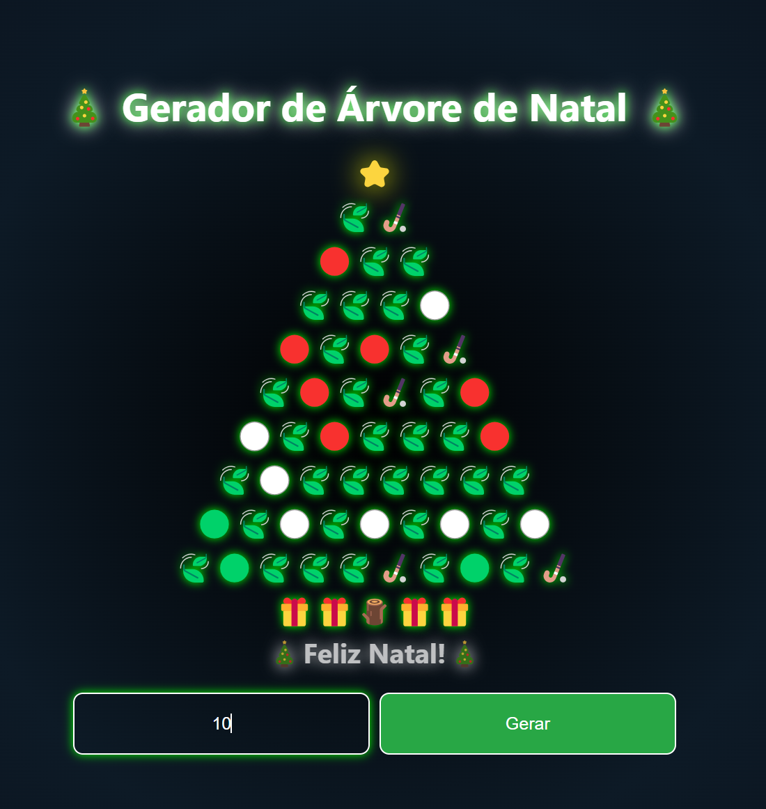

# 🎄 Gerador de Árvore de Natal - HTML & CSS 🎄
<p align="center">Um projeto divertido para celebrar o Natal! 🎅🎁</p>

<p align="center">
  <a href="https://juanfariasdev.github.io/Gerador-de-arvore-de-natal/" target="_blank">
    
  </a>
  <a href="https://github.com/juanfariasdev/Gerador-de-arvore-de-natal/blob/main/LICENSE">
    
  </a>
</p>

<p align="center">
  <a href="https://juanfariasdev.github.io/Gerador-de-arvore-de-natal/">
    ➡️ Acesse o projeto online clicando aqui!
  </a>
</p>

---

## 🎯 Sobre o Projeto

Este projeto gera uma árvore de Natal personalizada no navegador, com a quantidade de camadas que você definir. Cada camada é decorada com emojis aleatórios, criando uma árvore única a cada geração!

### Funcionalidades

- Escolha o tamanho da árvore (número de camadas).
- Decorações e enfeites gerados de forma aleatória.
- Interface simples e divertida.

## 🛠️ Como Executar Localmente

Para rodar o projeto localmente, siga os passos abaixo:

1. Clone o repositório:

   ```bash
   git clone https://github.com/juanfariasdev/Gerador-de-arvore-de-natal.git
   ```

2. Navegue até o diretório do projeto:

   ```bash
   cd Gerador-de-arvore-de-natal
   ```

3. Abra o arquivo `index.html` no seu navegador preferido.

## 🚀 Acesso Online

Se preferir, você pode testar o projeto diretamente no navegador através do [link online](https://juanfariasdev.github.io/Gerador-de-arvore-de-natal/).

---

## 🖼️ Screenshots

<p align="center">
    <div style="display: flex; justify-content: center; gap: 20px;">
        <div>
            <p align="center">2022</p>
            
        </div>
        <div>
            <p align="center">2024</p>
            
        </div>
    </div>
</p>


---

## 📄 Licença

Este projeto é distribuído sob a licença MIT. Para mais informações, consulte o arquivo [LICENSE](https://github.com/juanfariasdev/Gerador-de-arvore-de-natal/blob/main/LICENSE).

---

## 🧑‍💻 Autor

Desenvolvido com ❤️ por [Juan Pablo Farias](https://juanpablofarias.com/). Entre em contato e acompanhe meu trabalho!

<div align="center">
  <a href="https://www.linkedin.com/in/juanfariasdev/"></a>
  <a href="https://github.com/juanfariasdev"></a>
</div>